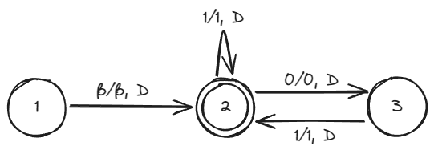

# TC - 4° avaliação

## Questão 1:

Estado|Codificação
---|---
1|1
2|11
3|111

R(F) = 11

Simbolo ľ | Codificação
---|---
β|1
0|11
1|111

Direção|Codificação
---|---
D|1
E|11

n°|Transição|Codificação
---|---|---
t1|δ(1, β) = [2, β, D]|1010110101
t2|δ(2, 1) = [2, 1, D]|110111011011101
t3|δ(2, 0) = [3, 0, D]|11011011101101
t4|δ(3, 1) = [2, 1, D]|1110111011011101

R(M) = 11001010110101001101110110111010011011011101101001110111011011101

## Questão 2:
a) S1 = ({a, b}, [(aba, a), (bbb, aaa), (aab, abab), (bb, babba)]).
    
    RES = {1, 4, 3, 1}

    ababbaababa
    ababbaababa

b) S2 = ({0, 1}, [(01, 0), (110010, 0), (1, 1111), (11, 01)]).

    RES = {1, 3, 2, 4, 4, 3}

    01111001011111
    01111001011111

c) S3 = ({0, 1}, [(01, 011), (001, 01), (10, 00)]).

    RES = {1, 3, 2}

    0110001
    0110001

d) S4 = ({a, b}, [(a, baa), (ab, aa), (bba, bb)]).

    RES = {3, 2, 3, 1}

    bbaabbbaa
    bbaabbbaa

e) S5 = ({a, b, c}, [(bb, b), (ab, ba), (c, bc)]).

    RES = {1, 3}

    bbc
    bbc

## Questão 3:
a) (y1 ∨ y2 ∧ x2)∨(y1 ∧ ~y2 ∧ x2)∧(y1 ∧ ~y2 ∧ ~x2)∨(~y1 ∧ y2 ∧ ~x2).

    Não está em CNF.
b) (~y1 ∨ ~y2 ∧ ^x2) ∧ (~y1 ∨ y2 ∨ ^x2) ∧ (~y1 ∨ y2 ∨ x2) ∧ (y1 ∨ ~y2 ∨ x2).

    Não está em CNF.
c) (x1 ∨ ~x2) ∧ (~x1 ∨ ~x3) ∧ (~x2 ∨ ~x3).

    Está em CNF.

    (x1 ∨ ~x2 ∨ z1) ∧ (x1 ∨ ~x2 ∨ ~z1) ∧ (~x1 ∨ ~x3 ∨ z2) ∧ (~x1 ∨ x3 ∨
    ~z2) ∧ (~x2 ∨ ~x3 ∨ z1) ∧ (~x2 ∨ ~x3 ∨ ~z3)

    T(x1) = 1, T(x2) = 0, T(x3) = 0, T(~z2) = 1
d) (a1 ∨ a2 ∨ a3 ∨ a4 ∨ a5 ∨ a6 ∨ a7 ∨ a8) ∧ (x1 ∨ x2) ∧ (x3).

    Está em CNF.

    (a1 ∨ a2 ∨ y1) ∧ (a3 ∨ ~y1 ∨ y2) ∧ (a4 ∨ ~y2 ∨ y3) ∧ (a5 ∨ ~y3 ∨
    y4) ∧ (a6 ∨ ~y4 ∨ y5) ∧ (a7 ∨ a8 ∨ ~y5) ∧ (x1 ∨ x2 ∨ z) ∧ (x1 ∨
    x2 ∨ ~z) ∧ (x3 ∨ u ∨ v) ∧ (x3 ∨ u ∨ ~v) ∧ (x3 ∨ ~u ∨ v)∧ (x3 ∨
    ~u ∨ ~v)

    T(a1) = 1, T(a2) = 1, T(a3) = 1, T(a4) = 1, T(a5) = 1, T(a6) = 1,
    T(a7) = 1, T(a8) = 1, T(x1) = 1, T(x2) = 1, T(x3) = 1
e) (a) ∧ (b ∨ c) ∧ (d ∨ e ∨ f) ∧ (g ∨ h ∨ i ∨ j) ∧ (k ∨ l ∨ m ∨ n ∨ o) ∧ (p ∨ q ∨ r ∨ s ∨ t ∨ u ∨ v ∨ w).

    Está em CNF.

    L = {z1, z2} L1 = {x1, x2, x3, x4}

    (a ∨ u ∨ v) ∧ (a ∨ u ∨ ~v) ∧ (a ∨ ~u ∨ v) ∧ (a ∨ ~u ∨ ~v) ∧ (b ∨
    c ∨ z) ∧ (b ∨ c ∨ ~z) ∧ (d ∨ e ∨ f) ∧ (g ∨ h ∨ y) ∧ (i ∨ j ∨ ~y)
    ∧ (k ∨ l ∨ z1) ∧ (m ∨ ~z1 ∨ z2) ∧ (n ∨ m ∨ z2) ∧ (p ∨ q ∨ x1) ∧
    (r ∨ ~x1 ∨ x2) ∧ (t ∨ ~x2 ∨ x3) ∧ (u ∨ ~x3 ∨ x4) ∧ (v ∨ w ∨ ~x4)

    T(a) = 1, T(b) = 1, T(c) = 1, T(d) = 1, T(e) = 1, T(f) = 1,
    T(g) = 1, T(h) = 1, T(i) = 1, T(j) = 1, T(k) = 1, T(l) = 1,
    T(m) = 1, T(n) = 1, T(o) = 1, T(p) = 1, T(q) = 1, T(r) = 1,
    T(s) = 1, T(t) = 1, T(u) = 1, T(v) = 1, T(w) = 1